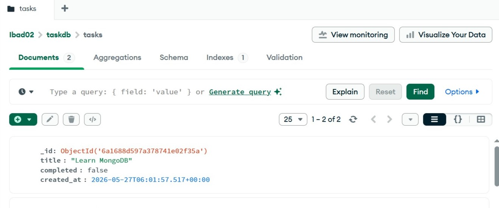
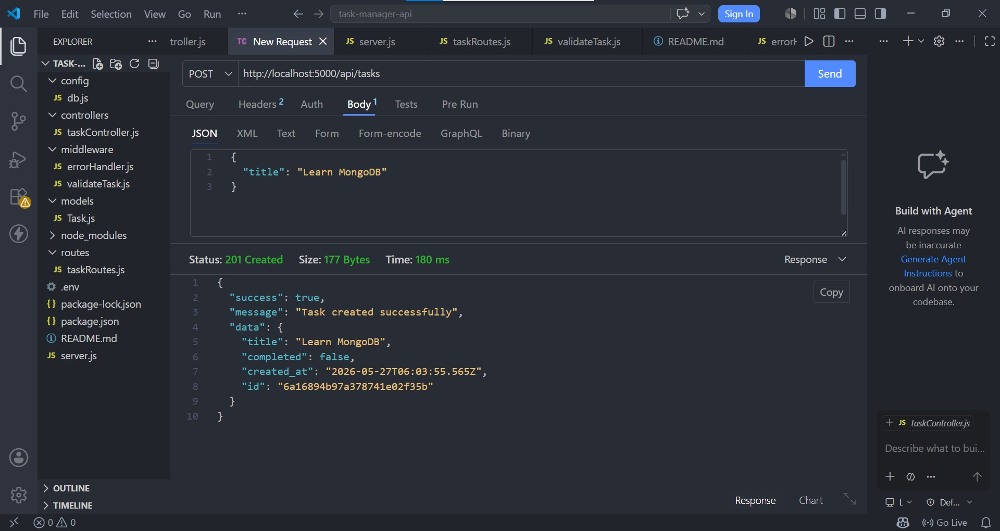

# Project 3 – Database Integration

## 📌 Overview
This project demonstrates backend integration with a database to store, retrieve, and manage application data using CRUD operations.

## ⚙️ Features
- Database schema design  
- Create, Read, Update, Delete (CRUD) operations  
- Backend–database connection  
- Structured data handling  

## 🛠️ Tech Stack
- Node.js  
- Express.js  
- MongoDB / SQL (depending on your setup)  

## 🧠 Key Learnings
- Database design fundamentals  
- CRUD operations  
- Data persistence techniques  
- Backend + database integration  

## 🚀 How to Run
1. Start database server  
2. Run backend: `node server.js`  
3. Test API endpoints  

## 📌 Status
Completed

## Screenshots

### MongoDB Collection

### POST API Request
